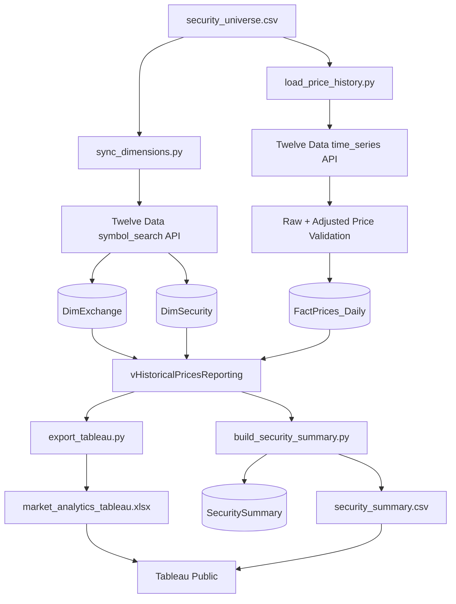

# Market Analytics Dashboard

[English](README.md) | [Español](README_ES.md)

A portfolio project that combines **Python, SQL Server, financial analysis, and Tableau Public** to build an end-to-end market analytics workflow for a curated universe of U.S. securities.

The project retrieves daily market data, validates and stores it in a relational model, calculates security-level return and risk metrics, exports Tableau-ready datasets, and presents the results in two interactive dashboards.

> **Current data snapshot:** January 2, 2019 through September 18, 2026. The pipeline itself is incremental and is designed to request only dates that are not already stored.

## Dashboard Preview

### 1. Security Analysis

Single-security view focused on historical price behavior, benchmark-relative performance, volatility, and drawdowns.


### 2. Market & Risk Overview

Cross-sectional view of the full security universe, including risk vs. return, return rankings, volatility rankings, benchmark spreads, and maximum drawdowns.


> **Tableau Public:**
> [View the interactive dashboard](https://public.tableau.com/app/profile/christian.alexander.castillo.solorzano6946/viz/TradingDashboard_17899727510140/02-MarketRiskOverview)

---

## Project Objectives

This project was built to answer practical market-analysis questions such as:

- How has each security performed over the historical period?
- What return has each security generated relative to its realized volatility?
- Which securities have produced the highest and lowest compound annual growth rates?
- Which securities experienced the deepest peak-to-trough losses?
- How does each security compare with the S&P 500 benchmark?
- How do risk and return profiles differ across sectors?

The broader goal is to demonstrate an analytics workflow that goes beyond dashboard design by combining **data extraction, transformation, relational modeling, validation, financial metric construction, and BI reporting**.

---

## Architecture



### Why two Tableau data sources?

The detailed historical dataset contains one row per security per trading day and supports time-series visuals. The summary dataset contains one row per security and supports cross-sectional rankings and risk/return comparisons without relying on complex table calculations.

Because the final visualization is built in **Tableau Public**, the project exports local SQL Server data to portable Excel/CSV files for visualization.

---

## Data Model

The SQL layer uses a simple dimensional structure.

```text
DimExchange
    ExchangeID (PK)
    ExchangeCode
    ExchangeName
    MIC
    Country
    Currency
    TimeZone

        1
        |
        |--< DimSecurity
                SecurityID (PK)
                ExchangeID (FK)
                Symbol
                CompanyName
                AssetType
                Sector
                Industry
                TradingCurrency

                        1
                        |
                        |--< FactPrices_Daily
                                PriceID (PK)
                                SecurityID (FK)
                                TradeDate
                                Open
                                High
                                Low
                                Close
                                AdjustedClose
                                Volume
```

The fact table is defined at the grain of **one row per security per trading day**, with a unique constraint on `(SecurityID, TradeDate)`.

A reporting view, `dbo.vHistoricalPricesReporting`, joins the price fact table to the security and exchange dimensions for downstream analytics and Tableau export.

---

## Security Universe

The current project contains **25 securities** across eight sectors plus SPY as the benchmark.

| Sector / Classification | Securities |
|---|---|
| Information Technology | AAPL, MSFT, NVDA |
| Financials | JPM, BAC, GS |
| Consumer Staples | KO, PG, WMT |
| Consumer Discretionary | AMZN, HD, MCD |
| Health Care | JNJ, UNH, PFE |
| Industrials | CAT, HON, UPS |
| Energy | XOM, CVX, COP |
| Communication Services | GOOGL, META, DIS |
| Benchmark | SPY |

The universe is configurable through `config/security_universe.csv`.

---

## Current Dataset Snapshot

| Metric | Value |
|---|---:|
| Securities | 25 |
| Historical price rows | 48,475 |
| First trading date | 2019-01-02 |
| Last trading date | 2026-09-18 |
| Observations per security | 1,939 |
| NYSE securities | 17 |
| NASDAQ securities | 8 |

The data range will extend when the incremental loader is run after the snapshot date.

---

## Data Pipeline

### 1. Security metadata synchronization

`sync_dimensions.py` reads the curated universe, queries Twelve Data's symbol-search endpoint, validates symbol/exchange matches, and upserts exchange and security metadata into SQL Server.

The script also stores exchange MIC, country, currency, timezone, asset type, sector, and trading currency where available.

### 2. Incremental historical price load

`load_price_history.py`:

- checks the latest `TradeDate` already stored for each security;
- requests only the missing date range;
- retrieves unadjusted OHLCV data;
- retrieves an adjusted price series separately;
- merges both series by trading date;
- validates the result;
- inserts new rows into `FactPrices_Daily`.

This allows the dataset to be refreshed without reloading the entire history on every run.

### 3. Security-level analytical summary

`build_security_summary.py` extracts historical adjusted prices from SQL Server and creates a one-row-per-security analytical layer containing:

- first and latest adjusted prices;
- total return;
- CAGR;
- annualized volatility;
- maximum drawdown;
- full-period relative performance vs. SPY;
- first/last trading dates;
- row counts and descriptive metadata.

The result is loaded into `dbo.SecuritySummary` and exported as `output/security_summary.csv` for Tableau Public.

### 4. Tableau export

`export_tableau.py` queries `dbo.vHistoricalPricesReporting`, validates the extract, and exports the detailed dataset to:

```text
output/market_analytics_tableau.xlsx
```

The workbook contains:

- `HistoricalPrices` — detailed reporting dataset;
- `ExtractSummary` — row count, security count, first date, and last date.

---

## Data Quality Controls

The pipeline includes validation before data is loaded into SQL Server.

Checks include:

- required configuration columns;
- duplicate security definitions;
- duplicate trading dates;
- missing price fields;
- invalid OHLC relationships;
- zero or negative prices;
- negative volume;
- security existence before fact loading;
- unique `(SecurityID, TradeDate)` records in SQL;
- unique securities in the analytical summary;
- expected security-count validation in the Tableau export.

API requests are also spaced to respect the configured request rate.

---

## Financial Metrics

### Total Return

```text
Total Return = Ending Adjusted Price / Beginning Adjusted Price - 1
```

### Compound Annual Growth Rate (CAGR)

```text
CAGR = (Ending Adjusted Price / Beginning Adjusted Price)^(365.25 / Days) - 1
```

### Daily Return

```text
Daily Return = Adjusted Price_t / Adjusted Price_(t-1) - 1
```

### Annualized Volatility

Daily return standard deviation annualized using 252 trading days:

```text
Annualized Volatility = StdDev(Daily Returns) × sqrt(252)
```

### Drawdown

```text
Drawdown = Adjusted Price / Running Peak - 1
```

### Maximum Drawdown

```text
Maximum Drawdown = Minimum historical Drawdown
```

### Full-Period Relative Performance vs. SPY

The Python summary compares each security's growth multiple with SPY over the same beginning and ending dates:

```text
Relative Performance vs SPY
= Security Growth Multiple / SPY Growth Multiple - 1
```

### CAGR Spread vs. SPY

For the market-overview dashboard, a more interpretable benchmark comparison is also used:

```text
CAGR Spread vs SPY = Security CAGR - SPY CAGR
```

A positive value represents an annualized return premium versus SPY; a negative value represents an annualized return discount.

### 30-Day Rolling Volatility

The Security Analysis dashboard calculates rolling volatility from the most recent 30 daily return observations and annualizes it using `sqrt(252)`.

---

## Dashboards

### Security Analysis

Designed for drill-down analysis of one selected security.

**Components**

- Current Adjusted Price
- CAGR
- Annualized Volatility
- Maximum Drawdown
- Adjusted Price History
- Relative Performance vs. SPY
- 30-Day Rolling Volatility
- Drawdown from Running Peak
- Security selector

### Market & Risk Overview

Designed for cross-sectional comparison across the full universe.

**Components**

- Risk vs. Return scatter plot
- Top-5 CAGR Ranking
- Top-5 Annualized Volatility Ranking
- CAGR Spread vs. SPY
- Maximum Drawdown Ranking
- Sector-based comparison and filtering

---

## Example Findings from the Included Snapshot

These observations describe the dataset currently included with the project and are not forecasts.

- **NVDA** had the highest CAGR in the universe at approximately **72.2%**, while also recording the highest annualized volatility at approximately **50.5%**.
- **META** recorded the deepest maximum drawdown in the selected history at approximately **-76.7%**.
- **SPY**, used as the benchmark, produced an approximately **17.2% CAGR**, **19.3% annualized volatility**, and **-33.7% maximum drawdown** over the included period.
- On an annualized basis, **NVDA's CAGR spread vs. SPY** was approximately **+54.9 percentage points**, while **PFE** was approximately **-17.6 percentage points**.

These comparisons illustrate why return should be evaluated together with volatility and drawdown rather than in isolation.

---

## Repository Structure

```text
Trading Analytics/
│
├── config/
│   └── security_universe.csv
│
├── python/
│   ├── extract_market_data.py
│   ├── load_sql.py
│   ├── sync_dimensions.py
│   ├── load_price_history.py
│   ├── build_security_summary.py
│   ├── export_tableau.py
│   └── check_spy_metadata.py
│
├── sql/
│   ├── schema.sql
│   ├── views.sql
│   └── test_data.sql
│
├── output/
│   ├── market_analytics_tableau.xlsx
│   └── security_summary.csv
│
├── assets/
│   ├── security-analysis-dashboard.png
│   └── market-risk-overview.png
│
├── Trading Dashboard.twb
├── .env                 # local only — do not commit
├── .gitignore
└── README.md
```

`extract_market_data.py` and `load_sql.py` are retained as earlier development/prototype scripts for testing the raw/adjusted price workflow and a single-security SQL load. The primary multi-security pipeline is driven by `sync_dimensions.py`, `load_price_history.py`, `build_security_summary.py`, and `export_tableau.py`.

---

## Tech Stack

- **Python** — API integration, transformation, validation, analytical calculations, exports
- **Pandas / NumPy** — data preparation and financial metrics
- **Requests** — Twelve Data API requests
- **SQL Server** — relational storage and reporting layer
- **PyODBC** — Python-to-SQL Server connectivity
- **T-SQL** — schema, constraints, joins, reporting views, validation queries
- **Tableau Public** — interactive financial dashboards
- **Excel / CSV** — portable reporting extracts for Tableau Public
- **Twelve Data API** — market prices and security metadata

---

## How to Run the Project

### 1. Prerequisites

Install:

- Python 3
- Microsoft SQL Server
- ODBC Driver 18 for SQL Server
- Tableau Public

Create the SQL Server database:

```sql
CREATE DATABASE MarketAnalytics;
```

Then run:

```text
sql/schema.sql
sql/views.sql
```

### 2. Create a Python environment

On Windows:

```powershell
python -m venv .venv
.\.venv\Scripts\Activate.ps1
```

Install the Python dependencies:

```powershell
pip install pandas numpy requests python-dotenv pyodbc xlsxwriter
```

### 3. Configure the API key

Create a local `.env` file in the project root:

```text
TWELVE_DATA_API_KEY=your_api_key_here
```

Do **not** commit `.env` to GitHub.

### 4. Load dimensions

```powershell
python python\sync_dimensions.py
```

### 5. Load / refresh historical prices

```powershell
python python\load_price_history.py
```

The loader is incremental: if a security already has historical data, it starts from the day after its latest stored trading date.

### 6. Build the security summary

```powershell
python python\build_security_summary.py
```

This refreshes the SQL summary table and creates:

```text
output/security_summary.csv
```

### 7. Export the detailed Tableau dataset

```powershell
python python\export_tableau.py
```

This creates:

```text
output/market_analytics_tableau.xlsx
```

### 8. Open Tableau

Open `Trading Dashboard.twb` in Tableau Public and, if required, reconnect the two local data sources to:

```text
output/market_analytics_tableau.xlsx
output/security_summary.csv
```

---

## Skills Demonstrated

This project demonstrates practical use of:

- API-based data extraction
- incremental ETL design
- dimensional data modeling
- SQL primary keys, foreign keys, and uniqueness constraints
- data-quality validation
- financial return and risk calculations
- benchmark analysis
- analytical summary-layer design
- Tableau table calculations and LOD expressions
- interactive dashboard design
- cross-sectional and time-series financial analysis

---

## Future Improvements

Potential extensions include:

- automated scheduled refreshes;
- parameterized historical start dates;
- additional benchmarks;
- Sharpe and Sortino ratios;
- beta and correlation analysis;
- sector-level benchmark comparisons;
- fundamental and valuation data;
- portfolio construction and weighting;
- automated testing and logging;
- CI/CD or scheduled pipeline execution.

---

## Disclaimer

This project is for **educational, analytical, and portfolio purposes**. It is not investment advice or a recommendation to buy or sell any security.
