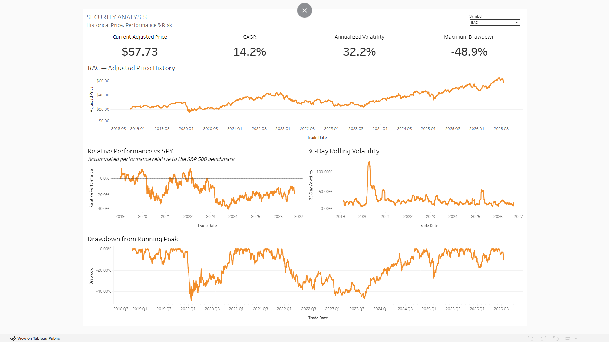
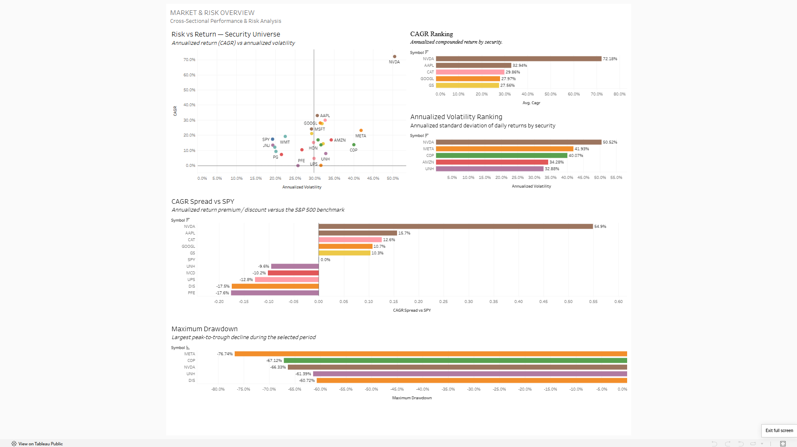
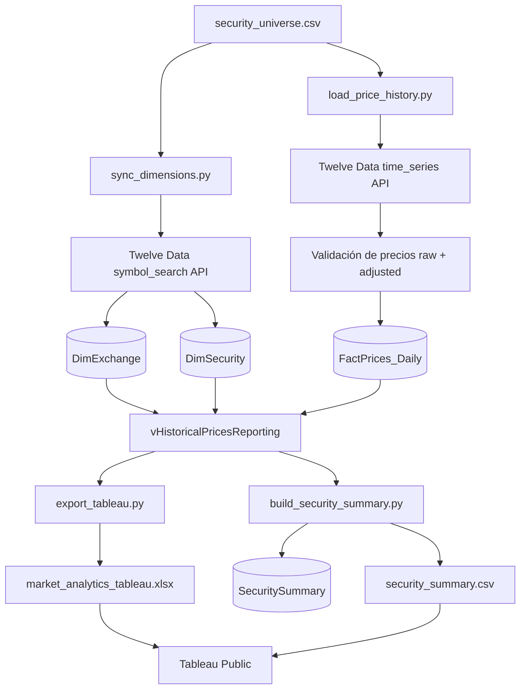

# Market Analytics Dashboard

[English](README.md) | [Español](README_ES.md)

Proyecto de portafolio que combina **Python, SQL Server, análisis financiero y Tableau Public** para construir un flujo de analítica de mercados de punta a punta sobre un universo curado de valores de Estados Unidos.

El proyecto obtiene datos diarios de mercado, los valida y almacena en un modelo relacional, calcula métricas de retorno y riesgo a nivel de security, exporta datasets listos para Tableau y presenta los resultados en dos dashboards interactivos.

> **Snapshot actual de datos:** 2 de enero de 2019 al 18 de septiembre de 2026. El pipeline es incremental y está diseñado para solicitar únicamente las fechas que todavía no están almacenadas.

## Vista previa de los dashboards

### 1. Security Analysis

Vista individual por security enfocada en comportamiento histórico del precio, desempeño relativo al benchmark, volatilidad y drawdowns.



### 2. Market & Risk Overview

Vista transversal del universo completo, incluyendo riesgo vs. retorno, rankings de retorno, volatilidad, spreads contra el benchmark y maximum drawdown.



> **Tableau Public:** agrega aquí la URL publicada del dashboard: `[Ver dashboard interactivo](PASTE_TABLEAU_PUBLIC_URL_HERE)`

---

## Objetivos del proyecto

Este proyecto fue construido para responder preguntas prácticas de análisis de mercado como:

- ¿Cómo se ha comportado cada security durante el período histórico?
- ¿Qué retorno ha generado cada security en relación con su volatilidad realizada?
- ¿Qué securities han producido los CAGR más altos y más bajos?
- ¿Qué securities experimentaron las caídas peak-to-trough más profundas?
- ¿Cómo se compara cada security con el benchmark S&P 500?
- ¿Cómo difieren los perfiles de riesgo y retorno entre sectores?

El objetivo más amplio es demostrar un flujo analítico que va más allá del diseño de dashboards al integrar **extracción de datos, transformación, modelado relacional, validación, construcción de métricas financieras y reporting en BI**.

---

## Arquitectura



### ¿Por qué se usan dos fuentes de datos en Tableau?

El dataset histórico detallado contiene una fila por security y día de trading, por lo que soporta visualizaciones de series de tiempo. El dataset resumen contiene una fila por security y permite construir rankings y comparaciones de riesgo/retorno sin depender de cálculos de tabla complejos.

Como la visualización final se construyó en **Tableau Public**, los datos almacenados localmente en SQL Server se exportan a archivos Excel/CSV portables.

---

## Modelo de datos

La capa SQL utiliza una estructura dimensional sencilla.

```text
DimExchange
    ExchangeID (PK)
    ExchangeCode
    ExchangeName
    MIC
    Country
    Currency
    TimeZone

        1
        |
        |--< DimSecurity
                SecurityID (PK)
                ExchangeID (FK)
                Symbol
                CompanyName
                AssetType
                Sector
                Industry
                TradingCurrency

                        1
                        |
                        |--< FactPrices_Daily
                                PriceID (PK)
                                SecurityID (FK)
                                TradeDate
                                Open
                                High
                                Low
                                Close
                                AdjustedClose
                                Volume
```

La tabla de hechos tiene un grain de **una fila por security por día de trading**, con una restricción única sobre `(SecurityID, TradeDate)`.

La vista `dbo.vHistoricalPricesReporting` une la tabla de precios con las dimensiones de security y exchange para facilitar el análisis y la exportación hacia Tableau.

---

## Universo de securities

El proyecto actual contiene **25 securities** distribuidos en ocho sectores, además de SPY como benchmark.

| Sector / Clasificación | Securities |
|---|---|
| Information Technology | AAPL, MSFT, NVDA |
| Financials | JPM, BAC, GS |
| Consumer Staples | KO, PG, WMT |
| Consumer Discretionary | AMZN, HD, MCD |
| Health Care | JNJ, UNH, PFE |
| Industrials | CAT, HON, UPS |
| Energy | XOM, CVX, COP |
| Communication Services | GOOGL, META, DIS |
| Benchmark | SPY |

El universo se configura desde `config/security_universe.csv`.

---

## Snapshot actual del dataset

| Métrica | Valor |
|---|---:|
| Securities | 25 |
| Filas históricas de precios | 48,475 |
| Primera fecha de trading | 2019-01-02 |
| Última fecha de trading | 2026-09-18 |
| Observaciones por security | 1,939 |
| Securities NYSE | 17 |
| Securities NASDAQ | 8 |

El rango de datos puede ampliarse al volver a ejecutar el loader incremental después de la fecha del snapshot.

---

## Pipeline de datos

### 1. Sincronización de metadata de securities

`sync_dimensions.py` lee el universo curado, consulta el endpoint de búsqueda de símbolos de Twelve Data, valida las coincidencias de símbolo/exchange y hace upsert de la metadata de exchanges y securities en SQL Server.

El script también almacena MIC, país, moneda, zona horaria, tipo de activo, sector y moneda de trading cuando están disponibles.

### 2. Carga incremental del histórico de precios

`load_price_history.py`:

- revisa el último `TradeDate` almacenado para cada security;
- solicita únicamente el rango de fechas faltante;
- obtiene datos OHLCV sin ajustar;
- obtiene por separado una serie de precios ajustados;
- une ambas series por fecha de trading;
- valida el resultado;
- inserta las nuevas filas en `FactPrices_Daily`.

Esto permite actualizar el dataset sin recargar todo el histórico en cada ejecución.

### 3. Resumen analítico a nivel de security

`build_security_summary.py` extrae precios ajustados históricos desde SQL Server y crea una capa analítica de una fila por security con:

- primer y último precio ajustado;
- total return;
- CAGR;
- volatilidad anualizada;
- maximum drawdown;
- desempeño relativo a SPY para todo el período;
- primera/última fecha de trading;
- número de observaciones y metadata descriptiva.

El resultado se carga en `dbo.SecuritySummary` y se exporta como `output/security_summary.csv` para Tableau Public.

### 4. Exportación para Tableau

`export_tableau.py` consulta `dbo.vHistoricalPricesReporting`, valida el extract y exporta el dataset detallado a:

```text
output/market_analytics_tableau.xlsx
```

El workbook contiene:

- `HistoricalPrices` — dataset detallado de reporting;
- `ExtractSummary` — número de filas, securities, primera fecha y última fecha.

---

## Controles de calidad de datos

El pipeline valida la información antes de cargarla en SQL Server.

Los controles incluyen:

- columnas requeridas en la configuración;
- definiciones duplicadas de securities;
- fechas de trading duplicadas;
- valores faltantes en campos de precios;
- relaciones OHLC inválidas;
- precios iguales o menores a cero;
- volumen negativo;
- existencia del security antes de cargar hechos;
- unicidad de `(SecurityID, TradeDate)` en SQL;
- securities únicos en el resumen analítico;
- validación del número esperado de securities en la exportación para Tableau.

Las solicitudes a la API también se espacian para respetar el límite configurado de requests.

---

## Métricas financieras

### Total Return

```text
Total Return = Precio ajustado final / Precio ajustado inicial - 1
```

### Compound Annual Growth Rate (CAGR)

```text
CAGR = (Precio ajustado final / Precio ajustado inicial)^(365.25 / Días) - 1
```

### Daily Return

```text
Daily Return = Precio ajustado_t / Precio ajustado_(t-1) - 1
```

### Annualized Volatility

La desviación estándar de los retornos diarios se anualiza utilizando 252 días de trading:

```text
Annualized Volatility = StdDev(Daily Returns) × sqrt(252)
```

### Drawdown

```text
Drawdown = Precio ajustado / Running Peak - 1
```

### Maximum Drawdown

```text
Maximum Drawdown = mínimo Drawdown histórico
```

### Full-Period Relative Performance vs. SPY

El resumen en Python compara el múltiplo de crecimiento de cada security contra SPY usando las mismas fechas inicial y final:

```text
Relative Performance vs SPY
= Security Growth Multiple / SPY Growth Multiple - 1
```

### CAGR Spread vs. SPY

Para el dashboard de mercado también se utiliza una comparación más interpretable contra el benchmark:

```text
CAGR Spread vs SPY = Security CAGR - SPY CAGR
```

Un valor positivo representa un premium de retorno anualizado frente a SPY; un valor negativo representa un descuento de retorno anualizado.

### 30-Day Rolling Volatility

El dashboard Security Analysis calcula volatilidad móvil utilizando las 30 observaciones más recientes de retornos diarios y la anualiza con `sqrt(252)`.

---

## Dashboards

### Security Analysis

Diseñado para analizar en detalle un security seleccionado.

**Componentes**

- Current Adjusted Price
- CAGR
- Annualized Volatility
- Maximum Drawdown
- Adjusted Price History
- Relative Performance vs. SPY
- 30-Day Rolling Volatility
- Drawdown from Running Peak
- Selector de security

### Market & Risk Overview

Diseñado para comparación transversal del universo completo.

**Componentes**

- Scatter plot de Risk vs. Return
- Top-5 CAGR Ranking
- Top-5 Annualized Volatility Ranking
- CAGR Spread vs. SPY
- Maximum Drawdown Ranking
- Comparación y filtrado por sector

---

## Ejemplos de hallazgos del snapshot incluido

Estas observaciones describen el dataset incluido actualmente y **no son pronósticos**.

- **NVDA** presentó el CAGR más alto del universo, aproximadamente **72.2%**, y también la mayor volatilidad anualizada, aproximadamente **50.5%**.
- **META** registró el maximum drawdown más profundo del período seleccionado, aproximadamente **-76.7%**.
- **SPY**, utilizado como benchmark, produjo aproximadamente **17.2% de CAGR**, **19.3% de volatilidad anualizada** y **-33.7% de maximum drawdown** durante el período incluido.
- En términos anualizados, el **CAGR spread de NVDA vs. SPY** fue de aproximadamente **+54.9 puntos porcentuales**, mientras que el de **PFE** fue de aproximadamente **-17.6 puntos porcentuales**.

Estas comparaciones muestran por qué el retorno debe evaluarse junto con volatilidad y drawdown, no de manera aislada.

---

## Estructura del repositorio

```text
Trading Analytics/
│
├── config/
│   └── security_universe.csv
│
├── python/
│   ├── extract_market_data.py
│   ├── load_sql.py
│   ├── sync_dimensions.py
│   ├── load_price_history.py
│   ├── build_security_summary.py
│   ├── export_tableau.py
│   └── check_spy_metadata.py
│
├── sql/
│   ├── schema.sql
│   ├── views.sql
│   └── test_data.sql
│
├── output/
│   ├── market_analytics_tableau.xlsx
│   └── security_summary.csv
│
├── assets/
│   ├── security-analysis-dashboard.png
│   └── market-risk-overview.png
│
├── Trading Dashboard.twb
├── .env                 # solo local — no subir a GitHub
├── .gitignore
├── README.md
└── README_ES.md
```

`extract_market_data.py` y `load_sql.py` se conservan como scripts tempranos/prototipos utilizados para probar el flujo de precios raw/adjusted y una carga SQL de un solo security. El pipeline principal multi-security se ejecuta con `sync_dimensions.py`, `load_price_history.py`, `build_security_summary.py` y `export_tableau.py`.

---

## Tech Stack

- **Python** — integración con API, transformación, validación, cálculos analíticos y exportaciones
- **Pandas / NumPy** — preparación de datos y métricas financieras
- **Requests** — consultas a Twelve Data API
- **SQL Server** — almacenamiento relacional y capa de reporting
- **PyODBC** — conectividad Python-SQL Server
- **T-SQL** — schema, constraints, joins, reporting views y queries de validación
- **Tableau Public** — dashboards financieros interactivos
- **Excel / CSV** — extracts portables para Tableau Public
- **Twelve Data API** — precios de mercado y metadata de securities

---

## Cómo ejecutar el proyecto

### 1. Prerrequisitos

Instalar:

- Python 3
- Microsoft SQL Server
- ODBC Driver 18 for SQL Server
- Tableau Public

Crear la base de datos:

```sql
CREATE DATABASE MarketAnalytics;
```

Luego ejecutar:

```text
sql/schema.sql
sql/views.sql
```

### 2. Crear un entorno de Python

En Windows:

```powershell
python -m venv .venv
.\.venv\Scripts\Activate.ps1
```

Instalar las dependencias:

```powershell
pip install pandas numpy requests python-dotenv pyodbc xlsxwriter
```

### 3. Configurar la API key

Crear un archivo `.env` local en la raíz del proyecto:

```text
TWELVE_DATA_API_KEY=your_api_key_here
```

**No subir `.env` a GitHub.**

### 4. Cargar dimensiones

```powershell
python python\sync_dimensions.py
```

### 5. Cargar / actualizar precios históricos

```powershell
python python\load_price_history.py
```

El loader es incremental: si un security ya tiene datos históricos, comienza desde el día siguiente a la última fecha de trading almacenada.

### 6. Construir el security summary

```powershell
python python\build_security_summary.py
```

Esto actualiza la tabla resumen en SQL y genera:

```text
output/security_summary.csv
```

### 7. Exportar el dataset detallado para Tableau

```powershell
python python\export_tableau.py
```

Esto genera:

```text
output/market_analytics_tableau.xlsx
```

### 8. Abrir Tableau

Abrir `Trading Dashboard.twb` en Tableau Public y, si fuera necesario, reconectar las dos fuentes locales a:

```text
output/market_analytics_tableau.xlsx
output/security_summary.csv
```

---

## Habilidades demostradas

Este proyecto demuestra uso práctico de:

- extracción de datos vía API;
- diseño de ETL incremental;
- modelado dimensional;
- primary keys, foreign keys y constraints de unicidad en SQL;
- validación de calidad de datos;
- cálculos financieros de retorno y riesgo;
- análisis contra benchmark;
- diseño de una capa analítica resumen;
- cálculos de tabla y expresiones LOD en Tableau;
- diseño de dashboards interactivos;
- análisis financiero transversal y de series de tiempo.

---

## Mejoras futuras

Posibles extensiones:

- refreshes automatizados y programados;
- fechas históricas parametrizadas;
- benchmarks adicionales;
- Sharpe y Sortino ratios;
- beta y análisis de correlación;
- comparaciones con benchmarks sectoriales;
- datos fundamentales y de valoración;
- construcción y ponderación de portafolios;
- testing y logging automatizados;
- CI/CD o ejecución programada del pipeline.

---

## Disclaimer

Este proyecto fue creado con fines **educativos, analíticos y de portafolio**. No constituye asesoría de inversión ni una recomendación de compra o venta de valores.
